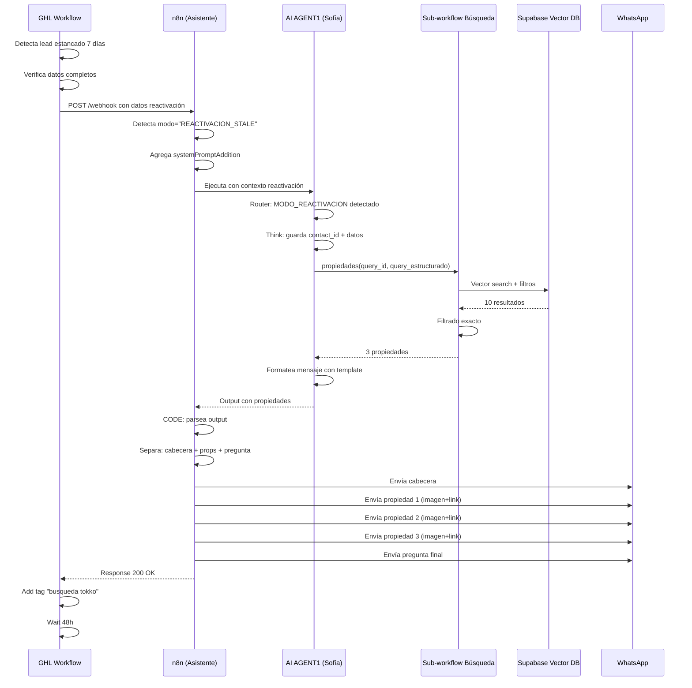

# 🔧 MODIFICACIÓN: ASISTENTE JUEJATI - MODO REACTIVACIÓN

## 📋 CAMBIO NECESARIO EN EL SYSTEM PROMPT

### **Agregar MODO 6 al Router:**

```markdown
┌─────────────────────────────────────────────────────────────┐
│ MODO 6: REACTIVACION_STALE                                  │
│ Lead estancado siendo reactivado desde workflow GHL         │
└─────────────────────────────────────────────────────────────┘

**Trigger:** 
- Mensaje contiene "contexto_reactivacion" O
- Parámetro modo = "REACTIVACION_STALE" en webhook

**Datos disponibles desde webhook:**
- contact_id (CRÍTICO)
- first_name
- zona (de custom field)
- tipo_propiedad (de custom field)
- presupuesto (de custom field)
- ambientes (de custom field)
- intencion (venta/alquiler de custom field)

**Actions:**

1. **Guardar contexto con Think:**
```json
{
  "contact_id": "{{contact_id}}",
  "first_name": "{{first_name}}",
  "queryzona": "{{zona}}",
  "querypropiedad": "{{tipo_propiedad}}",
  "querybudget_num": "{{presupuesto}}",
  "queryambientes": "{{ambientes}}",
  "queryoperacion": "{{intencion}}",
  "modo_reactivacion": true
}
```

2. **Ejecutar búsqueda INMEDIATAMENTE (sin preguntar nada):**

```javascript
propiedades(
  query_id=contact_id,
  query="zona:[zona];tipo:[tipo];ambientes:[amb];moneda:USD;precio_max:[presupuesto];operacion:[intencion]"
)
```

3. **Formato de mensaje (TEMPLATE ESPECÍFICO):**

```
Hola {{first_name}}! 👋

Hace unos días estuvimos conversando sobre tu búsqueda de {{tipo_propiedad}} en {{zona}}.

¿Seguís buscando? Tenemos propiedades nuevas que podrían interesarte 🏡

[PROPIEDADES - max 3]

¿Alguna te llama la atención?
```

**CRITICAL RULES para MODO_REACTIVACION:**

- ✅ SIEMPRE ejecutar búsqueda inmediatamente
- ✅ NO preguntar por datos (ya los tenemos)
- ✅ Máximo 3 propiedades (no más)
- ✅ Tono cálido pero no insistente
- ✅ Una sola pregunta al final
- ❌ NO mencionar "hace 7 días" o tiempo exacto
- ❌ NO pedir más información en primer mensaje
- ❌ NO usar "voy a buscar" o mencionar tools

**Formato de propiedades (EXACTO):**

```
[Título de la propiedad]
Precio: [Moneda] [Monto]
📍 [Barrio/zona]
🖼️ [url_imagen]
🔗 Ver ficha completa: [url]
```

**Ejemplo completo:**

```
Hola María! 👋

Hace unos días estuvimos conversando sobre tu búsqueda de departamento en Palermo.

¿Seguís buscando? Tenemos propiedades nuevas que podrían interesarte 🏡

[Departamento 2 ambientes con balcón]
Precio: USD 320,000
📍 Palermo Soho
🖼️ https://tokkobroker.com/images/prop123.jpg
🔗 Ver ficha completa: https://ficha.info/prop/123

[Luminoso 2 ambientes en Palermo Hollywood]
Precio: USD 295,000
📍 Palermo Hollywood
🖼️ https://tokkobroker.com/images/prop456.jpg
🔗 Ver ficha completa: https://ficha.info/prop/456

[Moderno con amenities]
Precio: USD 310,000
📍 Palermo Chico
🖼️ https://tokkobroker.com/images/prop789.jpg
🔗 Ver ficha completa: https://ficha.info/prop/789

¿Alguna te llama la atención?
```

═══════════════════════════════════════════════════════════════
```

---

## 🔧 IMPLEMENTACIÓN TÉCNICA

### **1. Modificar Webhook Trigger**

Actualizar el nodo `Webhook1` para aceptar parámetros de reactivación:

```javascript
// Nodo: Webhook1
// Expected payload cuando viene desde GHL Stale Opp:

{
  "body": {
    "contact_id": "xxx",
    "first_name": "María",
    "phone": "+54911...",
    "email": "maria@example.com",
    "message": "contexto_reactivacion",
    
    // Nuevos parámetros de reactivación
    "modo": "REACTIVACION_STALE",
    "zona": "Palermo",
    "tipo_propiedad": "Departamento",
    "presupuesto": "350000",
    "ambientes": "2",
    "intencion": "Venta"
  }
}
```

### **2. Modificar Router o AI AGENT1**

Agregar detección de modo reactivación:

**Opción A: En el System Prompt del AI AGENT1**

```markdown
Antes de clasificar el modo, verificar:

IF (mensaje contiene "contexto_reactivacion" OR modo == "REACTIVACION_STALE"):
  → Usar MODO_REACTIVACION
  → Saltear Router
  → Ejecutar búsqueda inmediata
ELSE:
  → Continuar con Router normal (5 modos actuales)
```

**Opción B: Agregar Switch antes del AI AGENT1**

```javascript
// Nuevo nodo: Switch - Detectar Reactivación
// Antes de Texto2 → AI AGENT1

IF {{$json.body.modo}} == "REACTIVACION_STALE"
  THEN → Ruta especial de reactivación
ELSE → Ruta normal (AI AGENT1 actual)
```

### **3. Crear System Prompt Addon para Reactivación**

```javascript
// Nuevo nodo: Edit Fields - Reactivación Context
// Agrega contexto al system prompt

const systemPromptAddition = `
═══════════════════════════════════════════════════════════════
MODO ESPECIAL: REACTIVACIÓN DE LEAD ESTANCADO
═══════════════════════════════════════════════════════════════

Este lead fue detectado automáticamente como estancado (7 días sin actividad).

DATOS DEL LEAD:
- Nombre: ${$json.body.first_name}
- Zona buscada: ${$json.body.zona}
- Tipo: ${$json.body.tipo_propiedad}
- Presupuesto: USD ${$json.body.presupuesto}
- Ambientes: ${$json.body.ambientes}
- Operación: ${$json.body.intencion}

INSTRUCCIONES:
1. Ejecutar búsqueda INMEDIATAMENTE con estos criterios
2. NO preguntar por información que ya tenemos
3. Usar template de reactivación (tono cálido, no insistente)
4. Máximo 3 propiedades
5. Terminar con pregunta simple

TEMPLATE EXACTO:
"Hola ${$json.body.first_name}! 👋

Hace unos días estuvimos conversando sobre tu búsqueda de ${$json.body.tipo_propiedad} en ${$json.body.zona}.

¿Seguís buscando? Tenemos propiedades nuevas que podrían interesarte 🏡

[PROPIEDADES]

¿Alguna te llama la atención?"
═══════════════════════════════════════════════════════════════
`;

return {
  json: {
    ...($json),
    systemPromptAddition: systemPromptAddition
  }
};
```

---

## 📞 LLAMADA DESDE GHL WORKFLOW

### **Configuración en GHL (Workflow SR01):**

```
┌─────────────────────────────────────────────────────────────┐
│ WORKFLOW: [AI] Reactivación Stale Opportunities            │
├─────────────────────────────────────────────────────────────┤
│                                                             │
│ TRIGGER: Stale Opportunities (7 días)                      │
│   ↓                                                         │
│                                                             │
│ IF: Verificar exclusiones                                  │
│   ↓                                                         │
│                                                             │
│ ADD TAG: "oportunidad estancada 7 dias"                    │
│   ↓                                                         │
│                                                             │
│ IF: Verificar datos completos                              │
│ ├─ zona: ¿existe?                                          │
│ ├─ tipo_propiedad: ¿existe?                                │
│ ├─ presupuesto: ¿existe?                                   │
│ └─ ambientes: ¿existe?                                     │
│   ↓                                                         │
│                                                             │
│ SI DATOS COMPLETOS:                                         │
│ ┌───────────────────────────────────────────────┐           │
│ │ HTTP REQUEST (Custom Webhook)                 │           │
│ ├───────────────────────────────────────────────┤           │
│ │ URL: https://n8n.korvance.com/webhook/        │           │
│ │      Asistente_Juejati_Brokers                │           │
│ │                                                │           │
│ │ Method: POST                                   │           │
│ │                                                │           │
│ │ Headers:                                       │           │
│ │   Content-Type: application/json              │           │
│ │                                                │           │
│ │ Body:                                          │           │
│ │ {                                              │           │
│ │   "contact_id": "{{contact.id}}",             │           │
│ │   "first_name": "{{contact.first_name}}",     │           │
│ │   "phone": "{{contact.phone}}",               │           │
│ │   "email": "{{contact.email}}",               │           │
│ │   "message": "contexto_reactivacion",         │           │
│ │   "modo": "REACTIVACION_STALE",               │           │
│ │   "zona": "{{contact.zona}}",                 │           │
│ │   "tipo_propiedad": "{{contact.tipo_de_propiedad_2}}",│  │
│ │   "presupuesto": "{{contact.presupuesto_ia}}",│           │
│ │   "ambientes": "{{contact.ambientes}}",       │           │
│ │   "intencion": "{{contact.intencion}}"        │           │
│ │ }                                              │           │
│ │                                                │           │
│ │ Response Handling:                             │           │
│ │   Store as: n8n_response                      │           │
│ │   Timeout: 30 seconds                          │           │
│ └───────────────────────────────────────────────┘           │
│   ↓                                                         │
│                                                             │
│ WAIT: 3 seconds (para que n8n envíe mensajes)              │
│   ↓                                                         │
│                                                             │
│ ADD TAG: "busqueda tokko"                                   │
│   ↓                                                         │
│                                                             │
│ CREATE NOTE: "Mensaje de reactivación enviado por IA"      │
│   ↓                                                         │
│                                                             │
│ WAIT: 48 hours                                              │
│   ↓                                                         │
│                                                             │
│ IF: ¿Respondió?                                            │
│ ├─ SÍ → Remove tag "oportunidad estancada 7 dias"         │
│ │       END workflow                                       │
│ │                                                           │
│ └─ NO → Continuar a Mensaje 2                              │
│                                                             │
│ SI DATOS INCOMPLETOS:                                       │
│ ┌───────────────────────────────────────────────┐           │
│ │ Send WhatsApp Message (Template genérico)     │           │
│ ├───────────────────────────────────────────────┤           │
│ │ "Hola {{contact.first_name}}! 👋             │           │
│ │                                                │           │
│ │ Te escribo de Juejati Brokers. ¿Seguís       │           │
│ │ buscando propiedad?                            │           │
│ │                                                │           │
│ │ Contame qué necesitás y te ayudo a            │           │
│ │ encontrar opciones 🏡"                        │           │
│ └───────────────────────────────────────────────┘           │
└─────────────────────────────────────────────────────────────┘
```

---

## 🎯 FLUJO COMPLETO VISUALIZADO



---

## 🔧 RESUMEN: CAMBIOS NECESARIOS

### **En n8n (Asistente Juejati):**

1. ✅ Modificar System Prompt: Agregar MODO_REACTIVACION
2. ✅ Agregar nodo Switch o Edit Fields para detectar modo
3. ✅ Template específico para mensaje de reactivación
4. ✅ Limit de 3 propiedades máximo en este modo

### **En GHL (Workflow SR01):**

1. ✅ HTTP Request a webhook de n8n
2. ✅ Enviar todos los custom fields necesarios
3. ✅ Parámetro modo="REACTIVACION_STALE"
4. ✅ Wait + verificar respuesta

### **Testing:**

1. ✅ Crear contacto de prueba con datos completos
2. ✅ Marcar como estancado manualmente
3. ✅ Verificar llamada a n8n con datos correctos
4. ✅ Verificar búsqueda en Supabase
5. ✅ Verificar formato de mensaje
6. ✅ Verificar envío a WhatsApp

---

## 💡 ALTERNATIVA SIMPLIFICADA (Sin AI)

Si no querés usar el Asistente IA para esto, podés hacer una versión más simple:

### **OPCIÓN 2: Template estático + n8n simple**

```
GHL Workflow SR01:
  ↓
GHL llama webhook n8n simple (no el Asistente)
  ↓
n8n busca directamente en Tokko API
  ↓
n8n formatea mensaje con template estático
  ↓
n8n envía a WhatsApp vía GHL API
  ↓
GHL continúa workflow
```

**Ventajas:**
- ✅ Más simple
- ✅ Más rápido
- ✅ Menos puntos de falla

**Desventajas:**
- ❌ Menos flexible
- ❌ Mensajes menos naturales
- ❌ No aprovecha el Asistente IA

---

¿Cuál preferís? ¿Usar el Asistente IA (opción 1) o crear un workflow simple separado (opción 2)?
